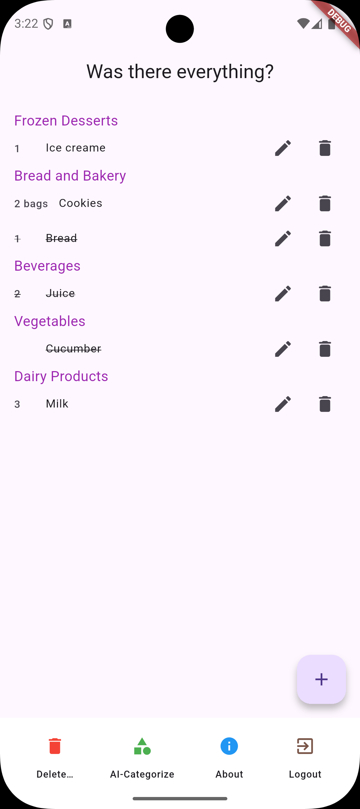
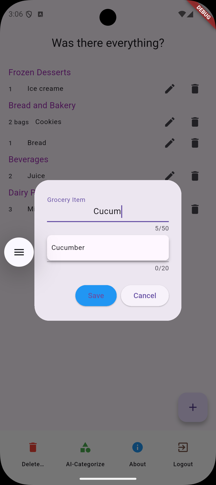

# Shopping List

A Flutter shopping list application with Firebase authentication, real-time data synchronization and AI-assisted item categorization.

The application stores shopping items in Cloud Firestore, allowing users to access their list on different devices when signed in with the same account.

## Features

- Email and password authentication
- Password reset by email
- Add, edit and delete shopping items
- Specify item quantities
- Mark items as acquired
- Remove acquired items or clear the entire list
- Item suggestions based on the user's previous entries
- AI-assisted categorization using the OpenAI API
- Group items by category

## Technologies

- **Flutter and Dart** — application and user interface
- **Firebase Authentication** — user authentication
- **Cloud Firestore** — data storage and real-time updates
- **Riverpod** — state management
- **SharedPreferences** — local application preferences
- **OpenAI API** — item categorization

## Project Structure

The main application code is located in `lib/`:

- `models/` — shopping item data model
- `screens/` — application screens and navigation
- `widgets/` — user interface components
- `notifiers/` — shopping list state and Firestore operations
- `utils/` — item suggestions and categorization
- `preferences/` — local application preferences

## Running the Application

You will need the Flutter SDK, a Firebase project with Authentication and Cloud Firestore enabled, and a device or emulator supported by your Flutter installation.

1. Clone the repository:

   ```bash
   git clone https://github.com/Wexo78/shopping_list.git
   cd shopping_list
   ```

2. Install dependencies:

   ```bash
   flutter pub get
   ```

3. Configure the application to use your own Firebase project. Generate the Firebase configuration with the FlutterFire CLI:

   ```bash
   flutterfire configure
   ```

4. Enable the Email/Password sign-in provider in Firebase Authentication and configure Firestore security rules to restrict access to each user's own data.

5. Create a `.env` file in the project root:

   ```dotenv
   OPENAI_API_KEY=your_openai_api_key
   BASE_URL=https://api.openai.com/v1/chat/completions
   ```

6. Run the application:

   ```bash
   flutter run
   ```

The current implementation loads `.env` at startup. AI categorization requires a valid OpenAI API key and API billing.

## Security and Current Limitations

This is a learning project with areas still to be improved.

- The current AI integration calls the OpenAI API directly from the Flutter application. Because `.env` is bundled as an application asset, an API key included in a distributed build can be extracted. This setup is intended for local development; the API call should be moved to a backend before wider distribution.
- Keep `.env` and other secret credentials out of version control.
- Firestore security rules must enforce user ownership. Filtering items by user ID in the application is not sufficient on its own.
- List synchronization currently uses the same account across devices. Sharing a list between separate user accounts is not implemented.
- The default Flutter widget test has not yet been adapted to the application.

## Learning Focus

The project combines user interface development, authentication, cloud storage, asynchronous operations and an external API integration.

It has provided practice in structuring a Flutter application, managing state with Riverpod and keeping application data synchronized through Firestore.

## Planned Improvements

- Move OpenAI requests to a backend and store the API key securely
- Improve error handling and input validation
- Add application-specific tests.
- Support shared lists between separate user accounts


## Screenshots

List view:
<p>
  
</p>


Adding item:
<p>
  
</p>